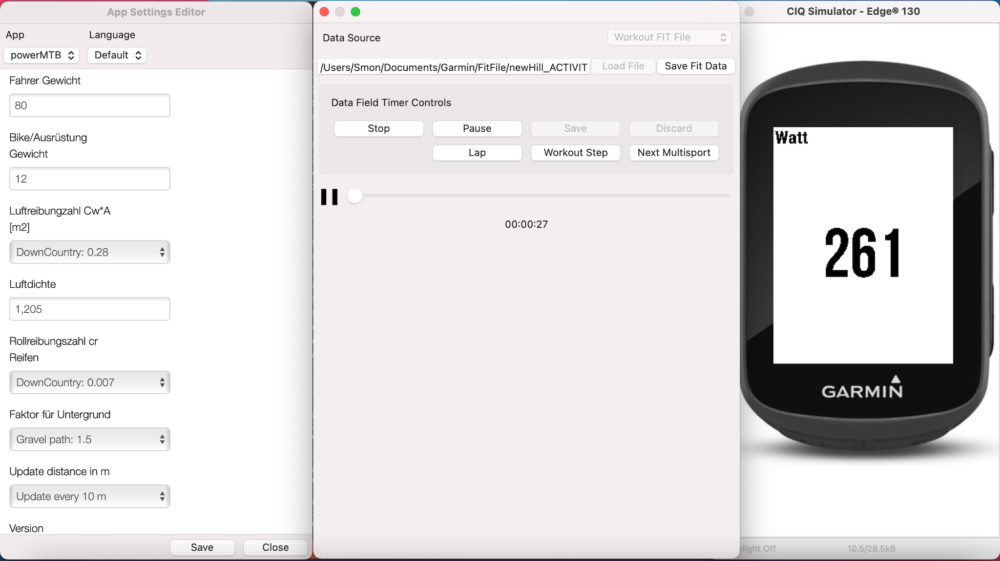

# PowerMTB SimpleDataField for Edge130

## TRAIN BY WATTS

This is actually just a simple watt data field which is in constant development. The trend in cycling is that the current performance is measured in watts/kg. This allows a relatively accurate evaluation, with which training progress can be measured. Watt measuring systems offer clear advantages compared to a training analysis via the heart rate, but are quite expensive and therefore mainly found in amateur and professional areas. I'm trying to develop a data field for my Garmin Edge 130, which calculates this power and displays it in plausible values.
I have checked my wattage readings using the Golden Cheetah open source software and individual online wattage meters. The biggest problem at the moment is that I can't include the wind force (headwind) in my calculations.There are devices on the market that integrate such values using sensors, which the Edge unfortunately does not provide.

Unfortunately, I cannot write the individual values into the Garmin overview because Garmin does not want this. The only way to read the values is in the three generated IQ graphics.

The Watchfield is of course in the development phase. I'm happy about any feedback or for help to make the Watchfield more accurate (as far as possible).

## Garmin Edge Screenshot

## Rolling Resistance Tires:
For more information on the wattage rating of your tire see this page:
<https://www.bicyclerollingresistance.com/mtb-reviews>

#### CrossCountry/Marathon

| Brand       | Tire Name                           | Year  | PSI/Bar           | Watts         |
| :---        | :---                                | :---  | :---              | :---          |
| Continental | Race King Protection                | 2015  | 35 PSI / 2.4 Bar  | 21.1 Watts    |
| Continental | Cross King Protection               | 2021  | 35 PSI / 2.4 Bar  | 29.8 Watts    |
| Schwalbe    | Rocket Ron LiteSkin Addix Speed     | 2017  | 35 PSI / 2.4 Bar  | 21.3 Watts    |
| Schwalbe    | Racing Ralph Super Race Addix Speed | 2021  | 35 PSI / 2.4 Bar  | 23.6 Watts    |
| Vittoria    | Mezcal                              | 2017  | 35 PSI / 2.4 Bar  | 28.4 Watts    |
| Maxxis      | Rekon Race EXO TR                   | 2019  | 35 PSI / 2.4 Bar  | 26.5 Watts    |
| Maxxis      | Aspen EXO TR                        | 2019  | 35 PSI / 2.4 Bar  | 26.2 Watts    |
| Maxxis      | Ardent Race 3C EXO TR               | 2016  | 35 PSI / 2.4 Bar  | 29.9 Watts    |
| Specialized | S-Works Fast Trak 2BR T5/T7         | 2022  | 35 PSI / 2.4 Bar  | 27.6 Watts    |

#### All Mountain

| Brand       | Tire Name                           | Year  | PSI/Bar           | Watts         |
| :---        | :---                                | :---  | :---              | :---          |
| Continental | Mountain King II RaceSport          | 2015  | 35 PSI / 2.4 Bar  | 29.6 Watts    |
| Maxxis      | Ardent Race 3C EXO TR               | 2016  | 35 PSI / 2.4 Bar  | 29.9 Watts    |
| Schwalbe    | Nobby Nic Performance               | 2014  | 35 PSI / 2.4 Bar  | 27.2 Watts    |
| Michelin    | Force AM                            | 2017  | 35 PSI / 2.4 Bar  | 33.6 Watts    |

#### Enduro

| Brand       | Tire Name                           | Year  | PSI/Bar           | Watts         |
| :---        | :---                                | :---  | :---              | :---          |
| Maxxis      | Minion DHR2                         | 20xx  | 35 PSI / 2.4 Bar  | 49.2 Watts    |
| Maxxis      | Shorty                              | 20xx  | 35 PSI / 2.4 Bar  | 36.3 Watts    |
| Onza        | Citius                              | 20xx  | 35 PSI / 2.4 Bar  | 40.2 Watts    |
| Schwalbe    | Magic Marry TrailStart              | 20xx  | 35 PSI / 2.4 Bar  | 43.7 Watts    |
| Schwalbe    | Hans Dampf TrailStar                | 2017  | 35 PSI / 2.4 Bar  | 38.5 Watts    |
| Continental | Baron Project:                      | 20xx  | 35 PSI / 2.4 Bar  | 43.8 Watts    |

## Build App for use

Follow Programmer's Guide to setup your Windows or Mac.  
Download Garmin Connect IQ SDK Manager.  
Use the SDK manager to download the latest Connect IQ SDK and devices.  
Once the download completes, click Yes when prompted to use the new SDK version as your active SDK.  
Close the SDK Manager.  
Install under Visual Studio Code the Monkey C Extension.  

In VS Code, click Ctrl + Shift + P (Command + Shift + P on Mac) and select "Monkey C: build for device".  
- Select were the .prg fiel should be stored.  
- Choose Debig or Release (I am using debug).  

Connect your device (Edge 130) with data cable to you PC/Mac and move the .prg file under APPS.  

## Useful Documentation

https://developer.garmin.com/connect-iq/programmers-guide/  
https://developer.garmin.com/downloads/connect-iq/monkey-c/doc/Toybox.html  
https://developer.garmin.com/connect-iq/compatible-devices/  

